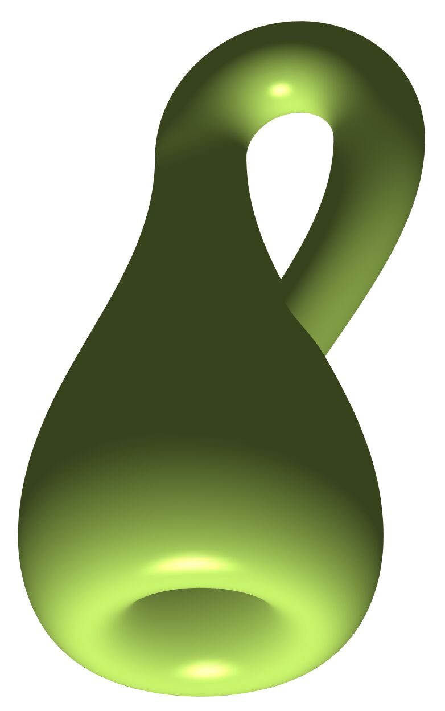

# Classification of surfaces

*Image: Aizenr, CC BY-SA 4.0, via [Wikimedia Commons](https://commons.wikimedia.org/wiki/File:Klein_bottle_green.png)*

**Intuition:** a complete catalogue — every closed surface is a sphere with some handles, or with some "cross-caps".

**Theorem:** every connected closed (compact, boundary-free) surface is homeomorphic to exactly one of:
1. the sphere (χ = 2);
2. a connected sum of g tori, g ≥ 1 — orientable, χ = 2 − 2g;
3. a connected sum of k projective planes, k ≥ 1 — non-orientable, χ = 2 − k.

So **[[euler-characteristic]] + orientability** identify a closed surface completely. The torus (g = 1) is the
doughnut of [[coffee-mug-and-donut]]; the Klein bottle is k = 2. Non-orientable example with boundary: the
Möbius strip.

Surfaces are 2-dimensional [[manifold]]s; [[compactness]] is the "closed" in closed surface. The theorem dates
from the 1860s. One dimension up things get much harder; the
[[poincare-conjecture]] asks only how to recognise the 3-sphere.
