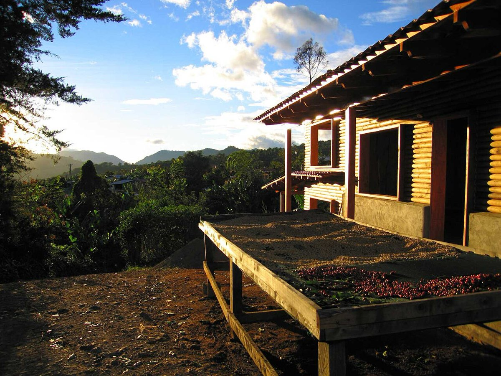

# Coffee processing

*Photo: Tarrazu at en.wikipedia, Public domain, via [Wikimedia Commons](https://commons.wikimedia.org/wiki/File:Coffee-cherries-afternoon-in-san-marcos-tarrazu-costa-rica.jpg)*

How the seed is freed from the cherry and dried — a major flavour lever, before any roasting.

| Process | What happens | Cup | Example |
|---|---|---|---|
| Washed | fruit removed, ferment (~2 days, or 16–24 h in Kenya), wash, dry | clean, bright | [[coffee-kenya]] |
| Honey | skin off, mucilage left on while drying (yellow < red < black) | sweeter, rounder, more body | Costa Rica, early 2000s |
| Natural | whole cherry dried 1–3 weeks | fruit-forward, sweet | [[coffee-brazil]] (8–10 days) |

Honey sits between the two: yellow honey is close to washed, black honey close to natural. The more fruit stays on,
the higher the risk of mould and over-fermentation during drying. [[coffee-ethiopia]] uses both washed and natural.
