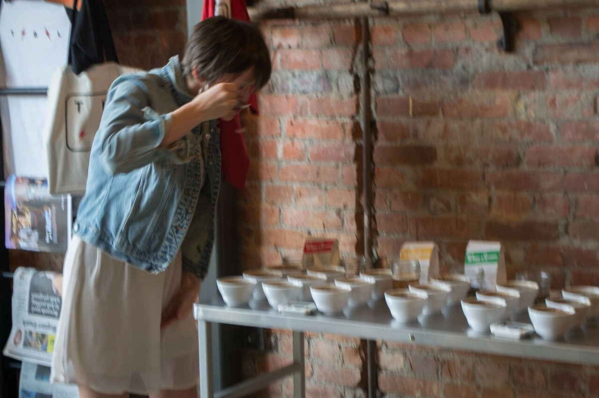

# Cupping

*Photo: Visitor7, CC BY-SA 3.0, via [Wikimedia Commons](https://commons.wikimedia.org/wiki/File:Coffee_Cupping-1.jpg)*

The professional way to taste coffees side by side: freshly ground coffee steeped with water just off the boil, sniffed
deeply, then slurped from a spoon (4–5 ml) so it sprays across the palate.

- **Judged:** aroma (fruity, floral, nutty, chocolate, earthy, spicy), taste (acidity, bitterness, sweetness,
  sourness), mouthfeel (body, astringency).
- **Vocabulary:** World Coffee Research's Sensory Lexicon — 110 attributes, each with a reference — is the basis of
  the SCA/WCR Coffee Taster's Flavor Wheel (2016, first redesign in ~20 years).
- **People:** certified tasters are Q Graders.

Good cuppers can often place an origin — e.g. the citrus and floral notes of [[coffee-ethiopia]] or the jasmine of
[[geisha]]. Processing ([[coffee-processing]]) and roast ([[roast-levels]]) shift what you taste.
