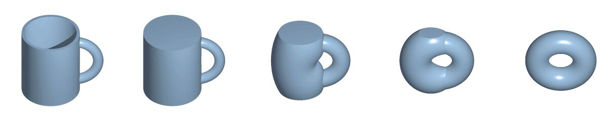

# Homeomorphism

*Image: Lucas Vieira, Public domain, via [Wikimedia Commons](https://commons.wikimedia.org/wiki/File:Mug_and_Torus_morph.gif)*

The whole deformation as a video (the same public-domain animation):

![[topology-mug-torus-morph.mp4|320]]

**Intuition:** a perfect rubber-sheet deformation — stretch and bend, but never cut or glue.

**Definition:** a bijection f: X → Y that is [[continuity|continuous]] and whose inverse is continuous too. Spaces
with a homeomorphism between them are *homeomorphic*: topologically the same.

**Examples:**
- a coffee mug and a doughnut (see [[coffee-mug-and-donut]]);
- a circle and the outline of a square;
- **not** a line and a plane: removing one point disconnects the line but not the plane ([[connectedness]]).

To prove two spaces are *not* homeomorphic, find an invariant that differs — see
[[topological-invariants-overview]]. [[homotopy]] equivalence is a looser relation. Note: every [[knot]] is
homeomorphic to a circle; knot theory asks about the surrounding space too.
