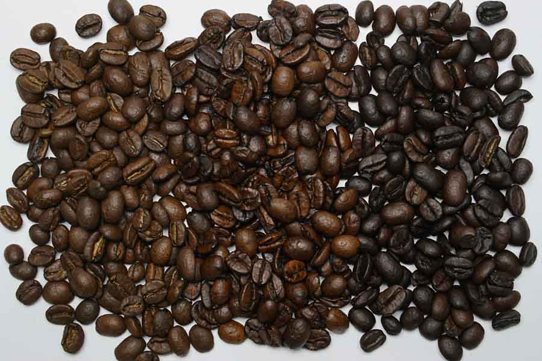

# Roast levels

*Photo: Your Best Digs, CC BY 2.0, via [Wikimedia Commons](https://commons.wikimedia.org/wiki/File:Light,_medium_and_dark_roasted_coffee_beans.jpg)*

Roasting browns the beans (Maillard reaction, caramelisation); they lose 15–18 % of their weight and roughly double
in volume.

| Level | Bean temp. | Marker | Cup |
|---|---|---|---|
| Light (cinnamon) | ~196–205 °C | first crack | light body, high acidity, origin shows |
| Medium (city, full city) | ~210–219 °C | after first crack | origin + some roast notes |
| Dark (French, Italian) | ~225–245 °C | second crack ~224 °C | full body, bittersweet, origin masked |

Darker = less acidity, more roast taste. To taste an origin like [[coffee-ethiopia]] or a variety like [[geisha]], go
light. Myth: dark roast has *less* caffeine per scoop, not more (it is less dense).
