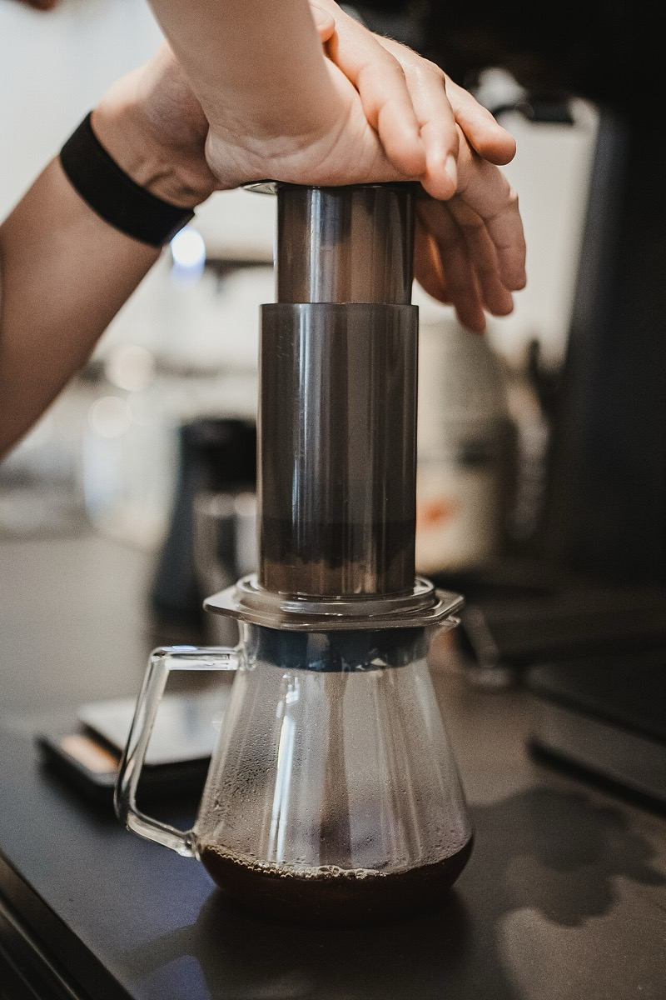

# AeroPress

*Photo: Craft Coffee Spot, CC BY 2.0, via [Wikimedia Commons](https://commons.wikimedia.org/wiki/File:Brewing_Coffee_with_AeroPress.jpg)*

A manual, non-electric brewer: coffee steeps in a cylinder, then hand pressure on a plunger pushes moderately hot water
through the grounds and a filter in about 30 seconds, one cup at a time.

- **Taste:** between a [[moka-pot]] and a [[french-press]].
- **Hybrid:** steeps like an immersion brewer, then is pressed — but by hand, far below [[espresso-machine]] pressure.
- Gap: the vault's source gives no grind or ratio — see [[brew-ratio]] and [[grind-size]] for defaults.
