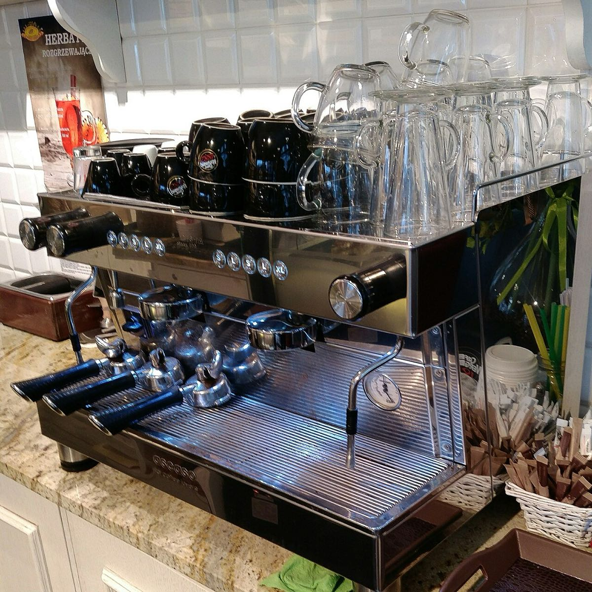

# Espresso machine

*Photo: MichalPL, CC BY-SA 4.0, via [Wikimedia Commons](https://commons.wikimedia.org/wiki/File:Espresso_machine_in_caf%C3%A9.jpg)*

Forces water at 91–95 °C through finely ground coffee at 8–18 bar, giving a 30–60 ml concentrated shot.

- **Grind:** the finest of the common methods ([[grind-size]]).
- **Versus moka:** the [[moka-pot]] reaches only about 1 bar and makes no crema.
- See [[which-brewer-for-which-bean]] and [[roast-levels]].
