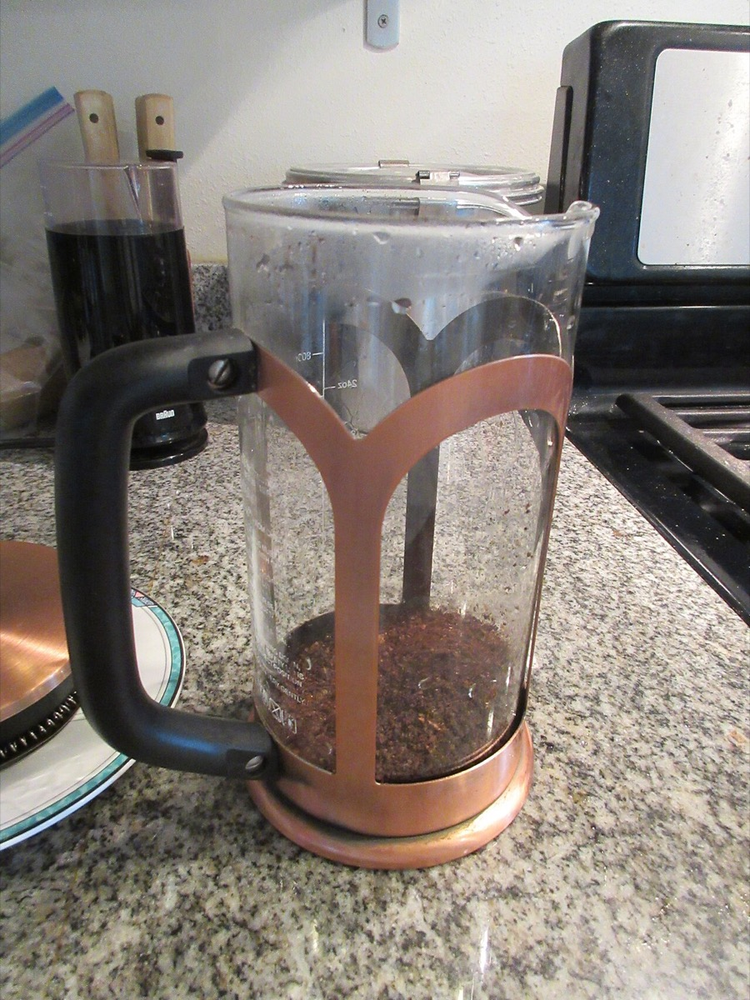

# French press

*Photo: Infrogmation, CC BY-SA 2.0, via [Wikimedia Commons](https://commons.wikimedia.org/wiki/File:French_Press_coffee_making_10.jpg)*

A tall cylinder with a mesh plunger. Coarse grounds steep in the water, then the plunger separates them.

- **Recipe:** coarse grind ([[grind-size]]), ~55 g/L ([[brew-ratio]]), steep about 4 minutes (sources range 4–7).
- **Pitfall:** pour off right after plunging — coffee left on the grounds keeps extracting and turns bitter ([[extraction]]).
- **Cup:** a mesh, not paper, so the oils that a thick paper filter holds back ([[chemex]]) stay in the cup. See [[which-brewer-for-which-bean]].
