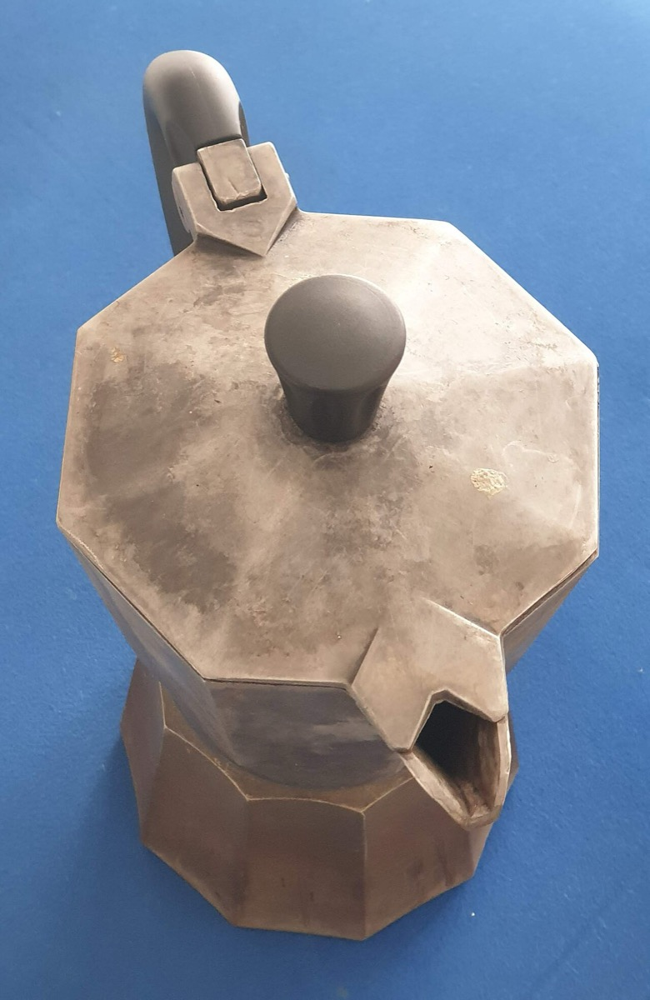

# Moka pot

*Photo: Karl Brodowsky, CC BY-SA 4.0, via [Wikimedia Commons](https://commons.wikimedia.org/wiki/File:Moka_Pot_on_Blue_Background_20200208.jpg)*

A three-chamber stovetop pot: water boils in the bottom, steam pressure of about one bar pushes it up through the coffee
basket into the top chamber.

- **Cup:** nearly espresso strength but without crema — not true espresso ([[espresso-machine]] works at 8–18 bar).
- **Taste:** the [[aeropress]] lands between moka and [[french-press]].
- Gap: the source gives no grind or dose. See [[which-brewer-for-which-bean]].
