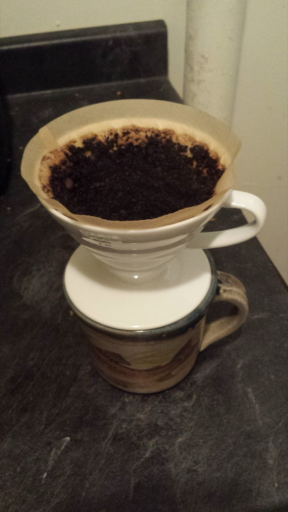

# Hario V60

*Photo: User:GorillaWarfare, CC BY-SA 1.0, via [Wikimedia Commons](https://commons.wikimedia.org/wiki/File:Coffee_pour_over_using_Hario_cone.jpg)*

A cone dripper with a 60° angle (hence the name), spiral ribs and one large hole. The hole drains fast, so *you*
control the flow with [[grind-size]] and pouring speed.

- **Recipe:** 21 g coffee, 1:15–1:17 ([[brew-ratio]]), water 90–96 °C, medium-fine grind (table salt).
- **Steps:** bloom with ~1.5× the coffee weight in water for 30–40 s, then slow spirals; done at ~4:00 ± 15 s.
- **Fix it:** fast + sour → finer / hotter / longer bloom; slow + bitter → coarser / cooler / shorter ([[extraction]]).
- Compared with the [[chemex]]: thinner paper, more body. See [[which-brewer-for-which-bean]].
