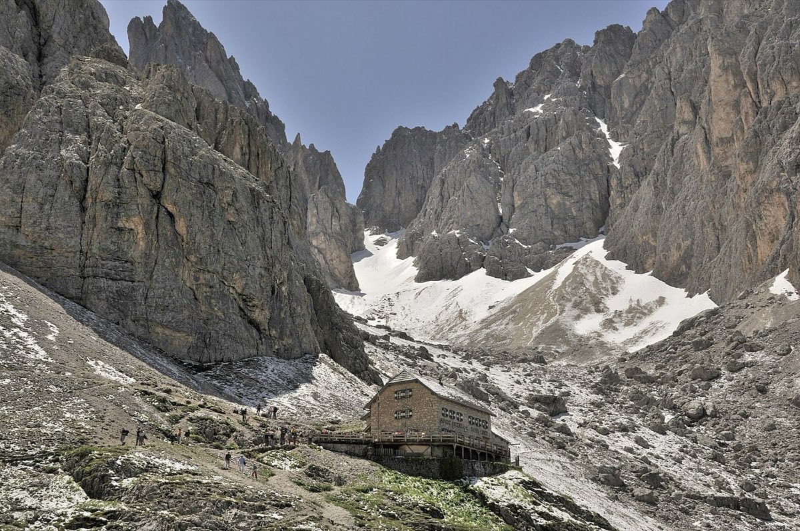

# Rifugio Vicenza / Langkofelhütte (2,256 m)

*Photo: Wolfgang Moroder, CC BY-SA 3.0, via [Wikimedia Commons](https://commons.wikimedia.org/wiki/File:Langkofelh%C3%BCtte_in_Gr%C3%B6den_mit_Langkofelgruppe.JPG)*

Hut in the Langkofelkar between Sassolungo and Sassopiatto, [[dolomites]]. Open since 1903: built by the Viennese alpine club, later run by the CAI Vicenza section. Destination of [[langkofelkar]].
