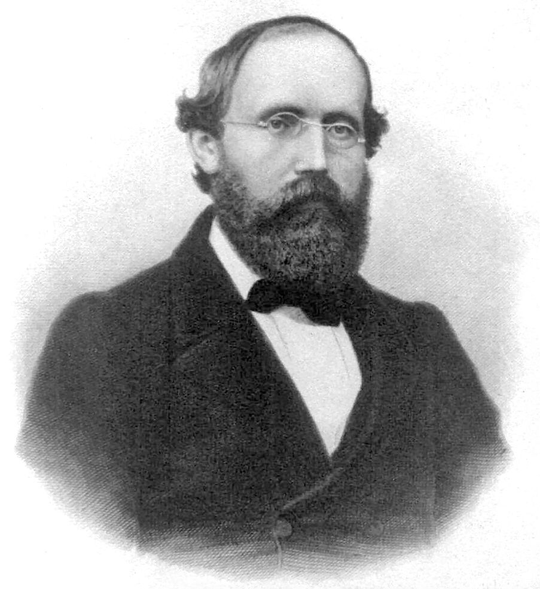

# Bernhard Riemann (1826–1866)

*Image: Unknown author, Public domain, via [Wikimedia Commons](https://commons.wikimedia.org/wiki/File:Georg_Friedrich_Bernhard_Riemann.jpeg)*

German mathematician, born in Breselenz (Hanover), died in Selasca (Italy).

- **Riemann surfaces** (thesis 1851): surfaces built so that multi-valued complex functions become single-valued;
  he studied how such surfaces are connected — early surface topology ([[classification-of-surfaces]]).
- **Manifolds:** his habilitation lecture of 10 June 1854, "On the hypotheses which lie at the foundations of
  geometry", introduced the idea of a *Mannigfaltigkeit* — a [[manifold]].
