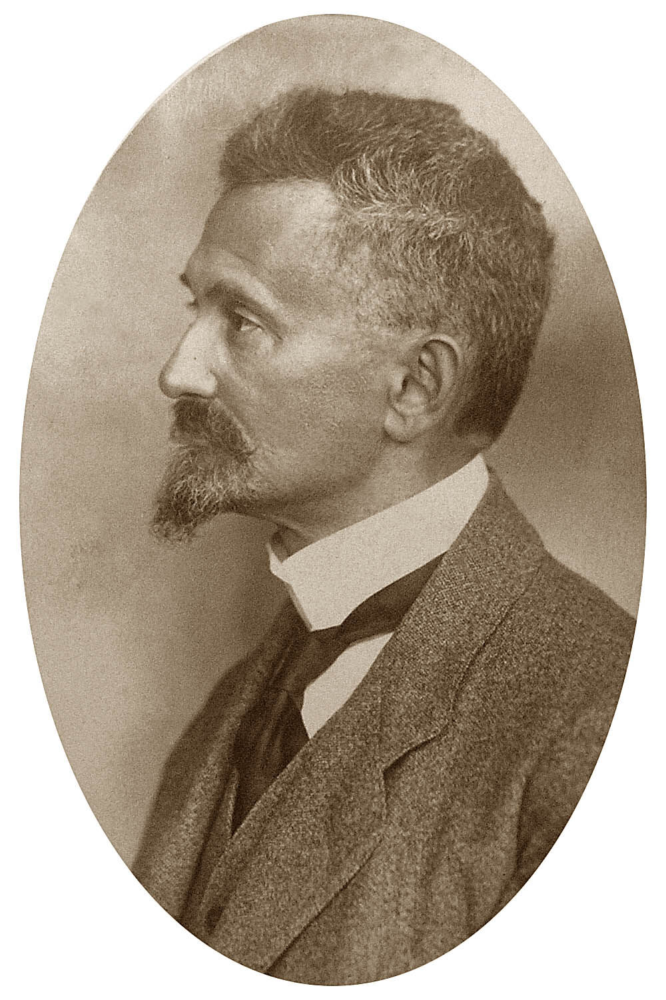

# Felix Hausdorff (1868–1942)

*Image: Unknown author, Public domain, via [Wikimedia Commons](https://commons.wikimedia.org/wiki/File:Hausdorff_1913-1921.jpg)*

German mathematician, born in Breslau (now Wrocław), died in Bonn.

- ***Grundzüge der Mengenlehre*** (1914) gave the first definition of a [[topological-space]] and coined the term —
  the starting point for [[open-set]]s and everything built on them.
- Hausdorff dimension (1919), e.g. log 2 / log 3 for the Cantor set.
- In 1942, facing internment by the Nazis, he took his own life together with his wife and her sister.
