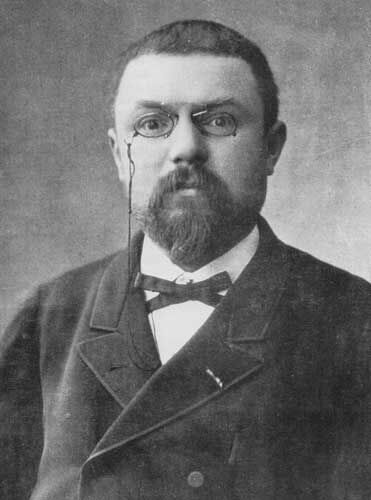

# Henri Poincaré (1854–1912)

*Image: Unknown author, Public domain, via [Wikimedia Commons](https://commons.wikimedia.org/wiki/File:Henri_Poincar%C3%A9-2.jpg)*

French mathematician, born in Nancy, died in Paris. The founder of algebraic [[topology]].

- ***Analysis situs*** (1895) and its sequels made topology rigorous: homology, [[homotopy]] and the
  [[fundamental-group]]. For about 40 years nearly all of algebraic topology built on this work.
- Proved the [[hairy-ball-theorem]] for the ordinary sphere (1885).
- Posed the [[poincare-conjecture]] (1904), solved by [[grigori-perelman]] a century later.
