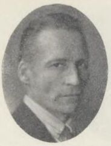

# L. E. J. Brouwer (1881–1966)

*Image: Unknown author, Public domain, via [Wikimedia Commons](https://commons.wikimedia.org/wiki/File:Luitzen_Egbertus_Jan_Brouwer.jpg)*

Dutch mathematician (Luitzen Egbertus Jan), born in Overschie, died in Blaricum. Did most of his topology in
1909–1913:

- the [[brouwer-fixed-point-theorem]] (general case 1909–1910);
- *invariance of dimension* — a continuous bijection can't change dimension;
- the [[hairy-ball-theorem]] for all even-dimensional spheres (1912).

Later founded intuitionism and distanced himself from his own classical proofs.
