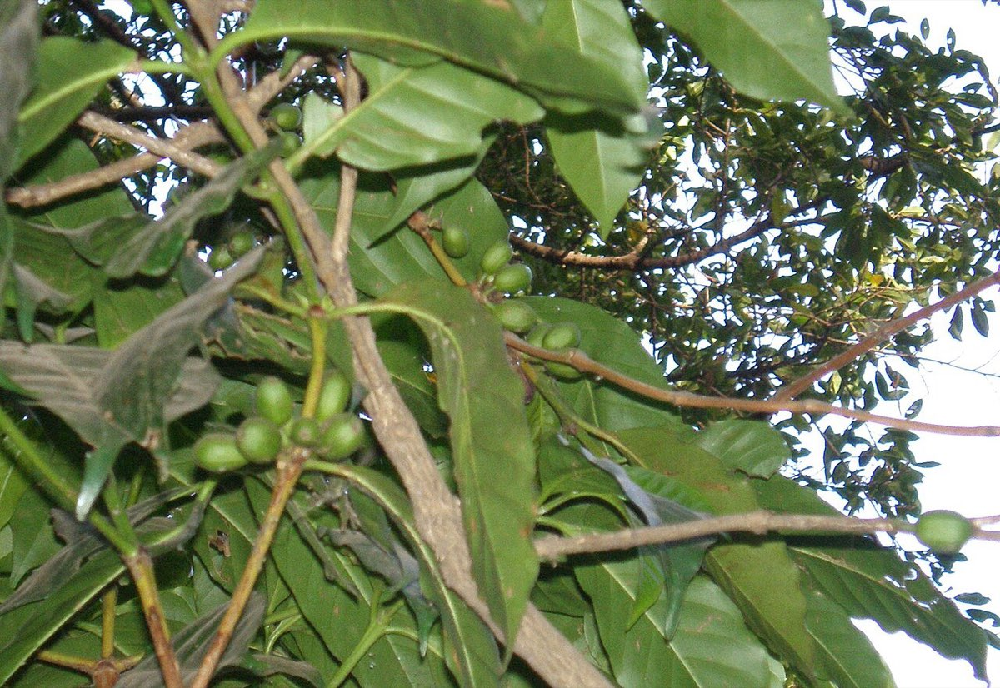

# Ethiopia

*Photo: Zheim, CC BY-SA 3.0, via [Wikimedia Commons](https://commons.wikimedia.org/wiki/File:PC090346_coffee_Bahar_Dahr_Ethiopia.jpg)*

The birthplace of Arabica: wild coffee still grows in the forests of Kaffa at about 1,400–2,100 m. Africa's largest
producer and roughly the world's fifth. Coffee comes from wild forest trees, homestead gardens and plantations, almost
all worked by hand.

- **Regions** (trademarked names): Sidama (1,500–2,200 m; berry and citrus, bright lemony acidity), Yirgacheffe and
  Guji (top quality within Sidama), Harar (eastern highlands, fruity and wine-like), Limu.
- **Gene pool:** both [[typica]] (via Java) and [[geisha]] (collected in the 1930s) started out as Ethiopian coffee.
- **Processing:** both washed and natural routes are used ([[coffee-processing]]); the sources give no split.
- **Brewing:** the bright, floral cups show best lightly roasted ([[roast-levels]]) on a clean filter such as
  [[v60]] or [[chemex]] — see [[which-brewer-for-which-bean]].

Gap: the sources give no harvest months for Ethiopia.
