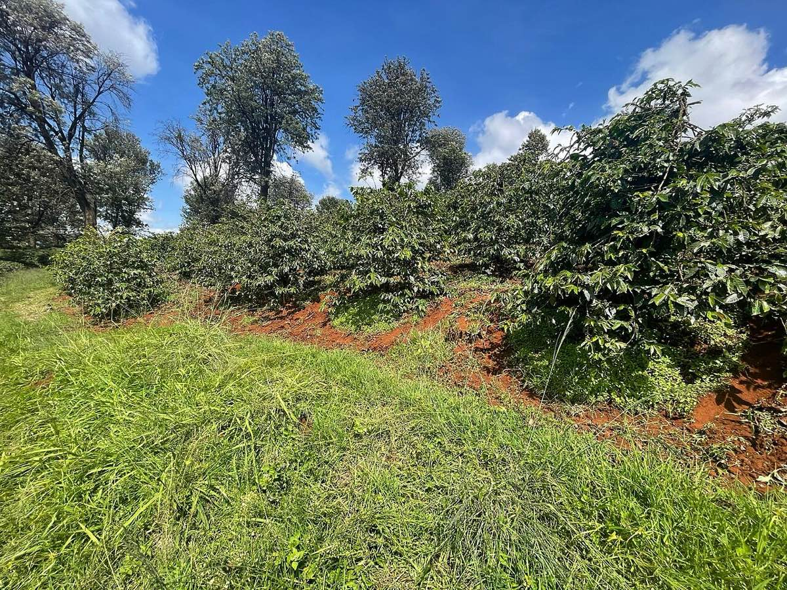

# Kenya

*Photo: Lebu Ayiga, CC BY 4.0, via [Wikimedia Commons](https://commons.wikimedia.org/wiki/File:Coffee_plantation_near_Kawaida_Falls,_Cianda,_Kiambu_County_01.jpg)*

Smallholder coffee organised in cooperatives: one example washing station in Murang'a (Central Kenya) serves 635
members, each with under a hectare and 200–350 trees, at 1,500–1,630 m on red volcanic soil.

- **Varieties:** [[sl28]] and SL34 (1930s selections, deep-rooted, drought tolerant) plus the disease-resistant Batian
  and Ruiru 11.
- **Harvest:** two crops in Central Kenya — early (May–July) and late (October–December), selectively handpicked.
- **Processing:** fully washed with an extra soak — 16–24 h fermentation, washing, ~12 h soak in clean water, then
  14–18 days on raised beds ([[coffee-processing]]).
- **Grade AA** = biggest beans (screen 17/18, > 7.2 mm). A size grade, not a flavour score.

Caveat: altitude and harvest months here come from one cooperative's profile, not a national figure.
