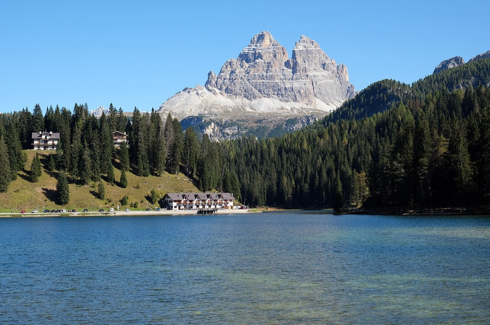

# Dolomites

*Photo: kallerna, CC BY-SA 4.0, via [Wikimedia Commons](https://commons.wikimedia.org/wiki/File:Lago_di_Misurina_Tre_Cime_di_Lavaredo_1.jpg)*

Limestone mountains in north-eastern Italy, famous for hut-to-hut treks and via ferratas.

Tours: [[alta-via-1]].

More tours (ideas): [[alpinisteig]], [[langkofelkar]], [[monte-nuvolau]], [[latemar-torre-di-pisa]]. Huts: [[zsigmondy-hut]], [[rifugio-vicenza]], [[rifugio-nuvolau]], [[rifugio-torre-di-pisa]], [[rifugio-passo-santner]], [[jimmi-hut]], [[bivacco-fiamme-gialle]].
