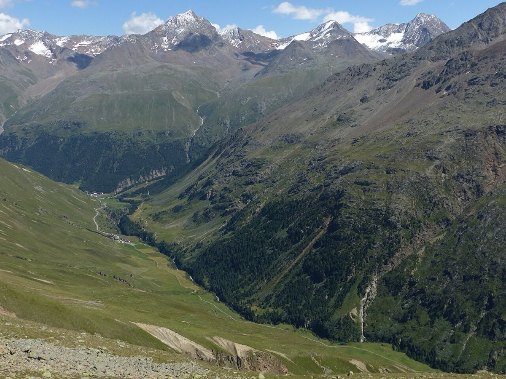

# Ötztal Alps

*Photo: Whgler, CC BY-SA 4.0, via [Wikimedia Commons](https://commons.wikimedia.org/wiki/File:Rofen_Vent_Rofental_Ramolkamm.jpg)*

Glaciated range in Tyrol, Austria, with the highest ski tours of the country. Base: Vent (1,895 m). Glacier season from March (huts open) to mid-May.

Tours: [[wildspitze]] (done), [[similaun]], [[fluchtkogel]]. Huts: [[martin-busch-hut]], [[vernagt-hut]], Breslauer Hütte.
