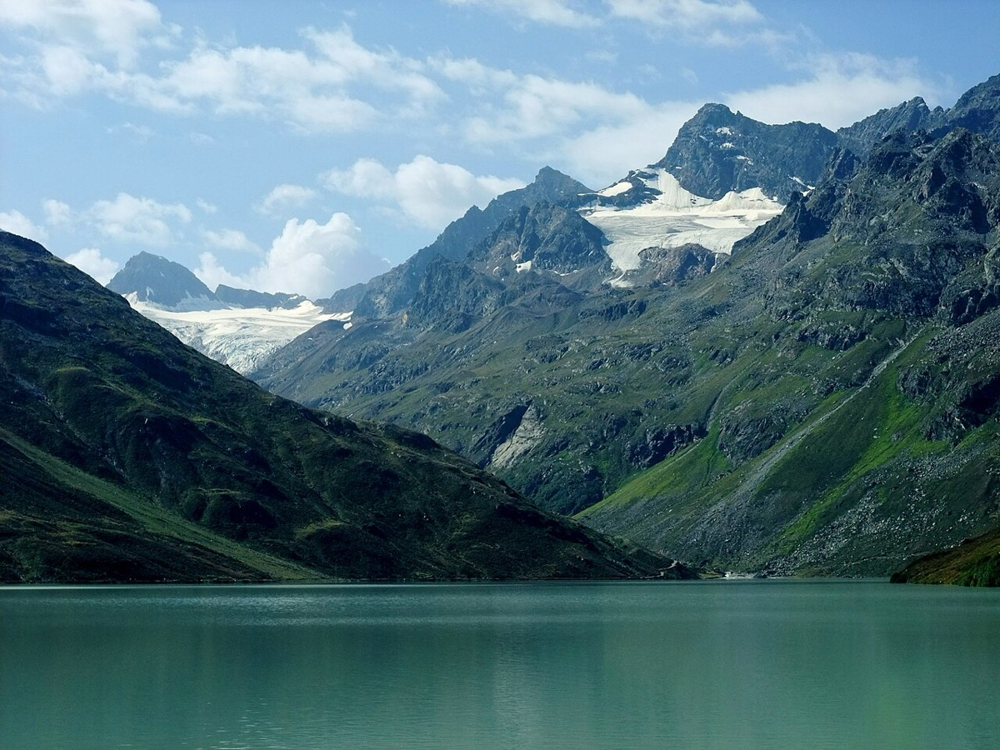

# Silvretta

*Photo: Nikater, Public domain, via [Wikimedia Commons](https://commons.wikimedia.org/wiki/File:Silvretta-Stausee03.jpg)*

Range on the border of Vorarlberg, Tyrol and Graubünden. In spring reached via Partenen and the winter lift to the Bielerhöhe (2,037 m).

Tours: [[piz-buin]] (done), [[dreilaenderspitze]]. Hut: [[wiesbadener-hut]].
