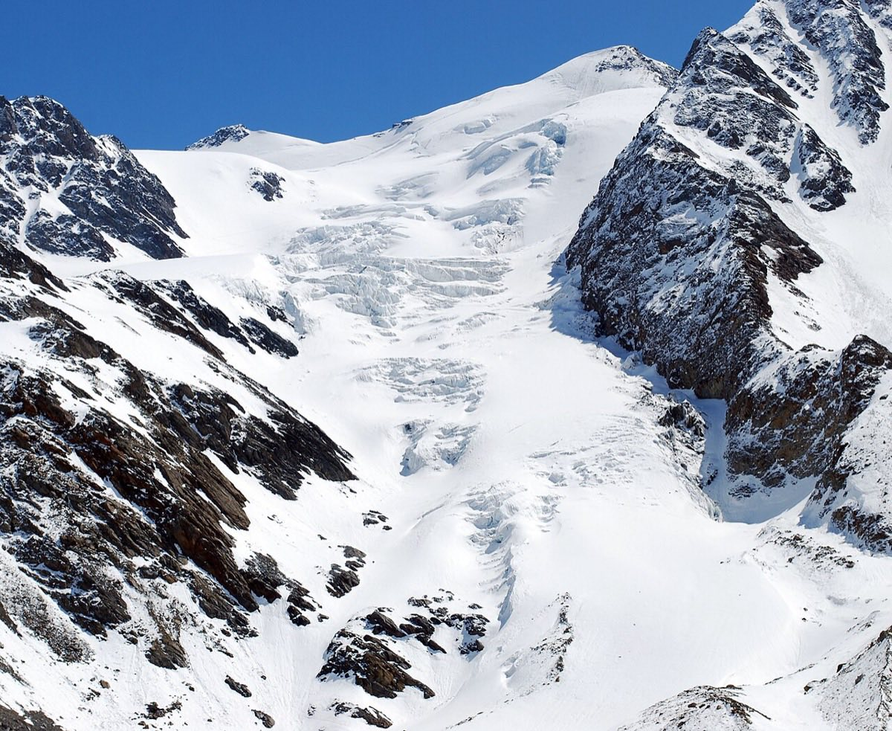

# Cevedale (3,769 m)

*Photo: Svíčková, CC BY-SA 3.0, via [Wikimedia Commons](https://commons.wikimedia.org/wiki/File:Cevedale,_Vedretta_del_Pasquale.JPG)*

One of the great spring tours of the Italian Alps. From the Forni car park to the [[rifugio-pizzini]], then over the Vedretta del Cevedale to the summit. Huge open glacier slopes.

- **Snow:** best in April and May, when the days are long and the snow has settled.
- **Not done yet.**
- Compared against [[similaun]] for a late-April trip: [[similaun-vs-cevedale-late-april]].

