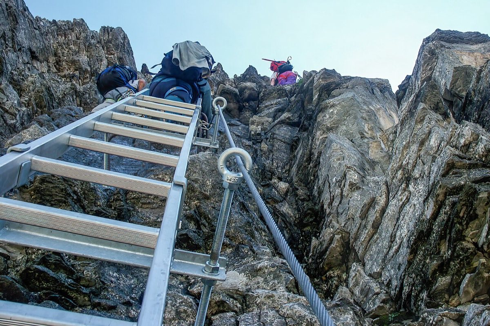

# Eiger-Rotstock via ferrata (2,663 m)

*Photo: Roy Egloff, CC BY-SA 4.0, via [Wikimedia Commons](https://commons.wikimedia.org/wiki/File:CH.BE.Grindelwald_2003-07-25_Via-Ferrata-Rotstock_06_3x2-R_4K.jpg)*

Short via ferrata on the Rotstock, a rock tower at the foot of the Eiger north face ([[bernese-alps]]). From the Eigergletscher station of the Jungfrau railway (approx. 2,320 m), approx. 350 m of ascent with several ladders; views across to Mönch and Jungfrau.

- **Not done yet** — only a clip so far; grade and times still to check.
