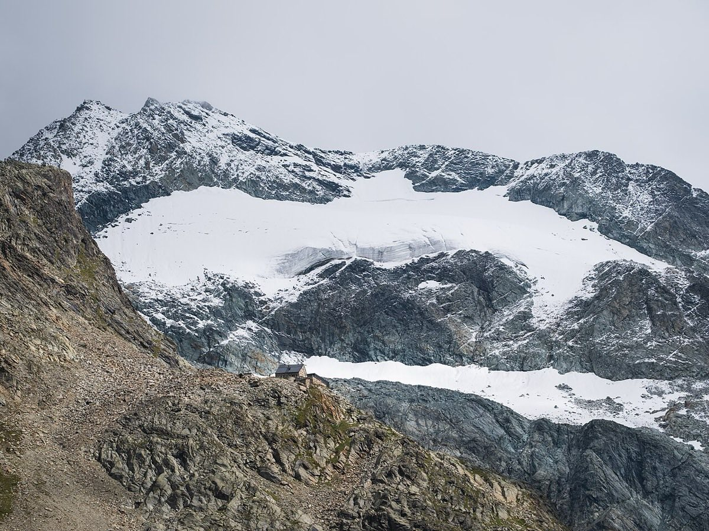

# Lac de Moiry → Cabane de Moiry (2,825 m)

*Photo: Christian David, CC BY-SA 4.0, via [Wikimedia Commons](https://commons.wikimedia.org/wiki/File:Cabane_de_Moiry,_Glacier_de_Moiry_et_Pigne_de_la_L%C3%A9.jpg)*

From the Moiry dam above Grimentz (Val d'Anniviers, toll road) up along the Moiry glacier to the [[cabane-de-moiry]], which sits right at the glacier's edge. Approx. 600 m and 2 hours of ascent.

- **Why:** sunset over the glacier and a night at the hut. Popular in summer — book early.
- **Not done yet** — an idea for the [[pennine-alps]].
