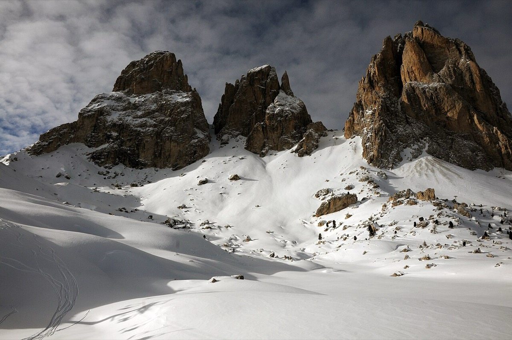

# Langkofelkar → Rifugio Vicenza (2,685 m)

*Photo: Wolfgang Moroder, CC BY-SA 3.0, via [Wikimedia Commons](https://commons.wikimedia.org/wiki/File:Langkofel_Group_from_Sellajoch.jpg)*

Into the cirque in the heart of the Sassolungo (Langkofel) group to the [[rifugio-vicenza]] (2,256 m), with rock on all sides: Langkofel, Fünffingerspitze, Grohmannspitze. Start at the Sella pass (approx. 2,240 m): either on foot into the Langkofelkar (approx. 2–3 h), or by gondola to the Forcella del Sassolungo (2,685 m) and a steep descent to the hut.

- **Not done yet** — an idea for the [[dolomites]].
