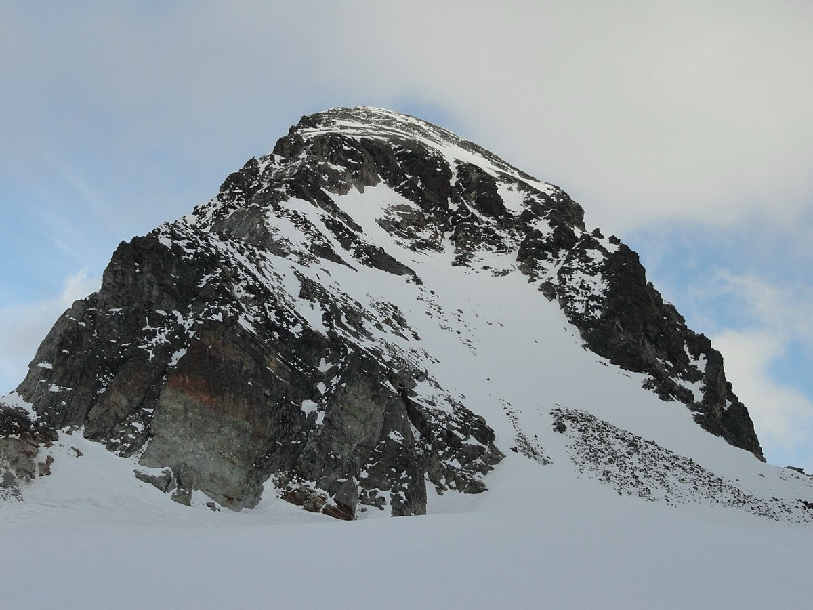

# Piz Buin (3,312 m)

*Photo: Svíčková, CC BY-SA 3.0, via [Wikimedia Commons](https://commons.wikimedia.org/wiki/File:Piz_Buin_vom_Ochsentaler_Gletscher.JPG)*

The classic of the [[silvretta]]: from the Bielerhöhe to the [[wiesbadener-hut]], over the Ochsentaler Gletscher to the Buinlücke, short scramble to the summit.

- **Snow:** north-facing glacier, reliable until May.
- **Done:** 20 April 2024, see [[tour-log]].
