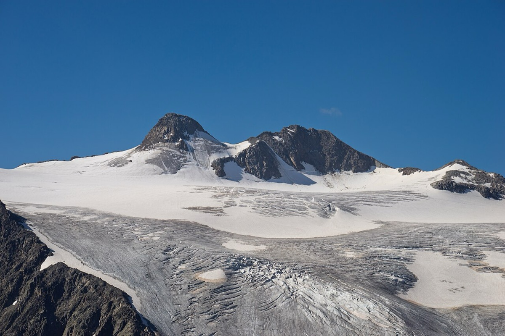

# Zuckerhütl (3,507 m)

*Photo: Jörg Braukmann, CC BY-SA 4.0, via [Wikimedia Commons](https://commons.wikimedia.org/wiki/File:Zuckerh%C3%BCtl.jpg)*

Highest summit of the [[stubai-alps]]. Glacier lifts from the Mutterbergalm save the first 1,000 m; then over the Pfaffenferner to the Pfaffenjoch and up the north-east flank (last metres on foot).

- **Snow:** glacier, north-east facing, March to May.
- **Not done yet.**
