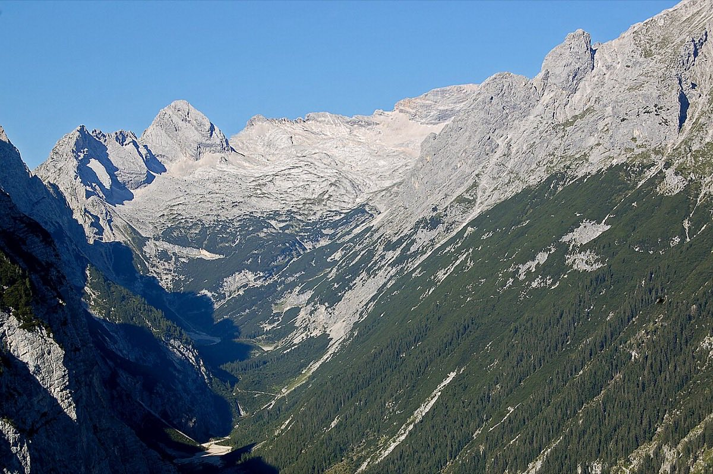

# Zugspitze via the Reintal (2,962 m)

*Photo: Sebastian Stürzl, CC BY-SA 3.0, via [Wikimedia Commons](https://commons.wikimedia.org/wiki/File:Wetterstein_Reintal_Zugspitzplatt_von_O_2009-09-01.jpg)*

Long two-day hike from Garmisch-Partenkirchen through the Partnachklamm and the Reintal, night at the Knorrhütte, then over the Zugspitzplatt to Germany's highest summit. About 2,200 m of ascent.

- **Season:** summer only.
- **Done:** 14–15 August 2023, see [[tour-log]].
